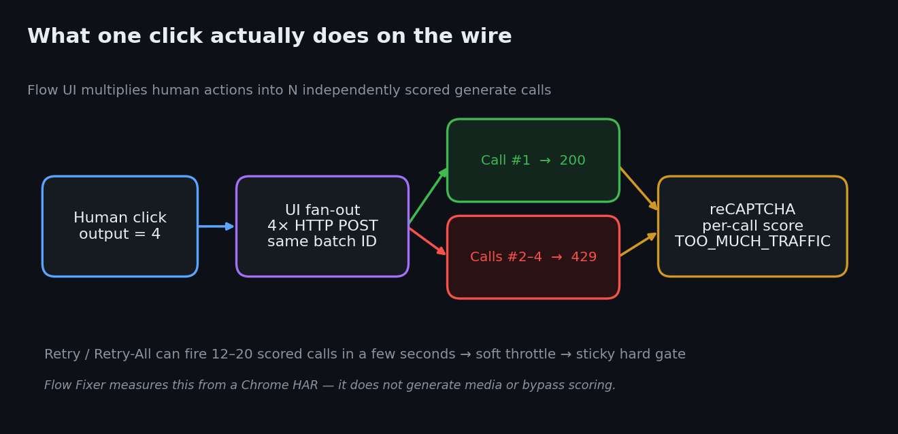
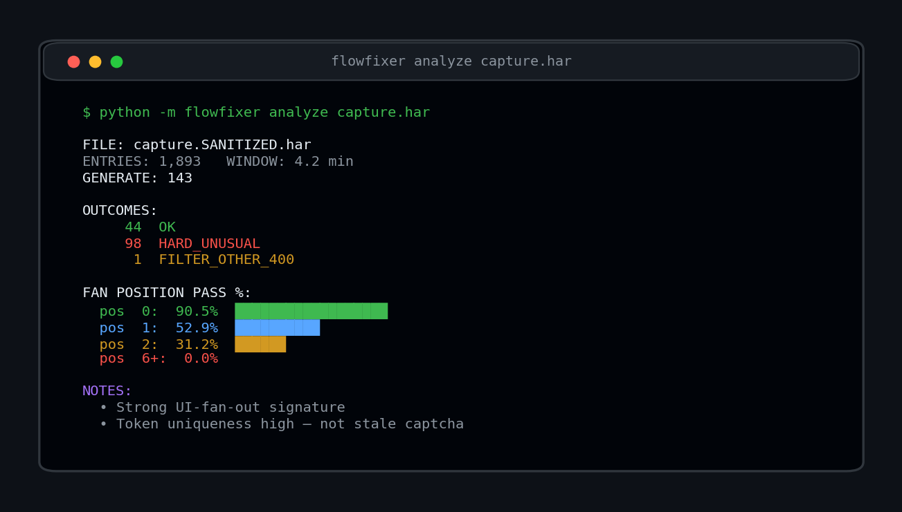
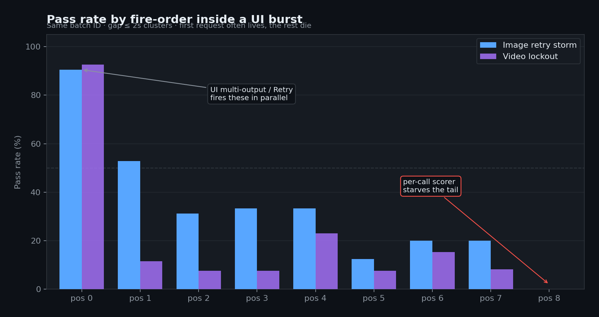
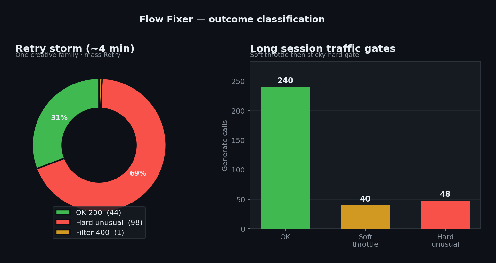

# Flow Fixer

<p align="center">
  <strong>Reliability toolkit for <a href="https://labs.google/fx/tools/flow">Google Flow</a></strong><br/>
  <sub>HAR forensics · live monitor · optional self-pacing — not a bypass tool</sub>
</p>

<p align="center">
  <a href="https://github.com/coldbricks/flow-fixer/releases/latest/download/flow-fixer-extension.zip"></a>
  <a href="https://github.com/coldbricks/flow-fixer/releases/latest"></a>
</p>

<p align="center">
  
  
  
  
</p>

**Flow Fixer** helps you see *why* Google Flow shows *“unusual activity”* or *“too quickly”* when you’re clicking Generate / Retry like a normal user.

**Core observation:** Flow scores **reCAPTCHA risk per generate HTTP call**, while the UI often turns **one click into N parallel generate calls** (multi-output ≈ 4; Retry-All often 12–20). Pass rate can collapse by fire-order inside a burst. Optional **AUTO-THROTTLE** paces *your own* clicks so you don’t overspeed into a sticky lockout.

It does **not** forge reCAPTCHA, automate generation, or evade abuse systems. Processing is **local** in your browser or on your machine.

Technical write-up: **[docs/ENG_BRIEF.md](docs/ENG_BRIEF.md)** · Privacy: **[PRIVACY.md](PRIVACY.md)** · Security: **[SECURITY.md](SECURITY.md)**

<p align="center">
  
</p>
<p align="center">
  <sub>Extension UI: hard unusual-activity gate → auto downshift to Molasses + cool-down. Full speed ladder + live classify.</sub>
</p>

<p align="center">
  
</p>
<p align="center">
  <sub>What users see in Flow: failed cards with Retry still available — retries add more scored HTTP calls.</sub>
</p>

---

## Download the browser extension

**[↓ flow-fixer-extension.zip](https://github.com/coldbricks/flow-fixer/releases/latest/download/flow-fixer-extension.zip)**  
(stable URL — always the latest release)

### Install (Chrome / Edge / Brave)

1. Download the zip (link above)  
2. Unzip somewhere permanent (don’t delete the folder later)  
3. Open `chrome://extensions` or `edge://extensions`  
4. Enable **Developer mode**  
5. **Load unpacked** → select the folder that contains `manifest.json`  
6. Open [Flow](https://labs.google/fx/tools/flow) → **hard refresh** (`Ctrl+Shift+R`)  
7. Pin **Flow Fixer**

Chrome does not allow one-click install from GitHub (Web Store only). Download → unzip → Load unpacked is the normal open-source path.

Full extension docs: **[extension/README.md](extension/README.md)**

### What the extension does

| Feature | Notes |
|---------|--------|
| Live soft / hard / filter classification | From generate responses |
| Fan-position pass rates | UI burst shape |
| **AUTO-THROTTLE** | Optional; default on. Paces/serializes *your* generate calls |
| Speed ladder | Molasses → Casey Jones (see below) |
| Export JSON / **Copy report** | Last **500** events; project IDs redacted; no prompts/tokens |
| Diagnostics strip | Inject heartbeat + net hits; **project UUIDs redacted** for safer screenshots |
| Settings persist | Auto-throttle / monitor / gear survive browser restart |

**AUTO-THROTTLE off** = monitor only (no pacing).  
**Casey Jones** = full parallel fan-out — will trip soft/hard quickly under load; use intentionally.

---

## Python CLI (HAR forensics)

```bash
git clone https://github.com/coldbricks/flow-fixer.git
cd flow-fixer
python -m pip install -e .

python -m flowfixer sanitize raw.har -o safe.har
python -m flowfixer analyze safe.har
python -m flowfixer report  safe.har -o report.md
```

Never share a **raw** HAR (cookies/auth). Always sanitize first.

| Command | Purpose |
|---------|---------|
| `sanitize` | Redact cookies, auth, tokens, project/session IDs, credit numbers |
| `analyze` | Soft vs hard vs filter · bursts · fan-position |
| `report` | Markdown summary |

Requires **Python 3.10+**.

---

## The request shape (diagram)

<p align="center">
  
</p>

<p align="center">
  
</p>

---

## Fan-position chart

Pass rate by **fire-order inside a burst** (gap ≤ 2s). First call often lives; the tail often dies.

<p align="center">
  
</p>

| Observation | Interpretation |
|-------------|----------------|
| Fresh unique reCAPTCHA tokens on failed calls | Not simply “stale captcha” |
| Same creative payload, mixed 200 / 429 | Timing/burst position matters |
| Soft vs hard are different reason codes | Two machines, not one |
| Hard can stay sticky for many minutes | Short “try again” guidance may be incomplete |

<p align="center">
  
</p>

More detail: **[docs/ENG_BRIEF.md](docs/ENG_BRIEF.md)** · Operating tips: **[docs/OPS_DOCTRINE.md](docs/OPS_DOCTRINE.md)** · Wire map: **[docs/INTERNAL_MAP.md](docs/INTERNAL_MAP.md)**

---

## Speed ladder (extension)

| Gear | Idea | Approx gap |
|------|------|------------|
| 🧊 Molasses | Way under typical throttle | ~9s |
| 💧 Water | Calm | ~4.5s |
| 🚶 Brisk Walk | Human pace | ~2.5s |
| 💼 The Job | Default work cadence | ~1.2s |
| 🎸 Highway Star | Spicy but serialized | ~0.6s |
| 🐎 Black Beauty | Fast | ~0.3s |
| 🚂 Casey Jones | Full parallel | none |

**Auto shift:** soft → downshift; hard → Molasses + cool-down; clean OK streak → gradual upshift.

---

## What this is not

- Not a bot, undress tool, or unlimited-generation script  
- Not a reCAPTCHA solver or score spoofer  
- Not multi-account farming  
- Not legal advice; not affiliated with Google  

Issues asking how to evade abuse detection will be closed. See [SECURITY.md](SECURITY.md).

---

## Project layout

```text
extension/     Chrome/Edge MV3 extension (also shipped as release .zip)
flowfixer/     Python CLI
docs/          Technical brief, ops notes, wire map, assets
fixtures/      Synthetic HAR only
scripts/       Package + chart helpers
```

Rebuild extension zip: `powershell -ExecutionPolicy Bypass -File scripts/package_extension.ps1`

---

## License

MIT — [LICENSE](LICENSE)

Google Flow, Veo, Gemini, and related marks are Google’s. This is an independent project.
